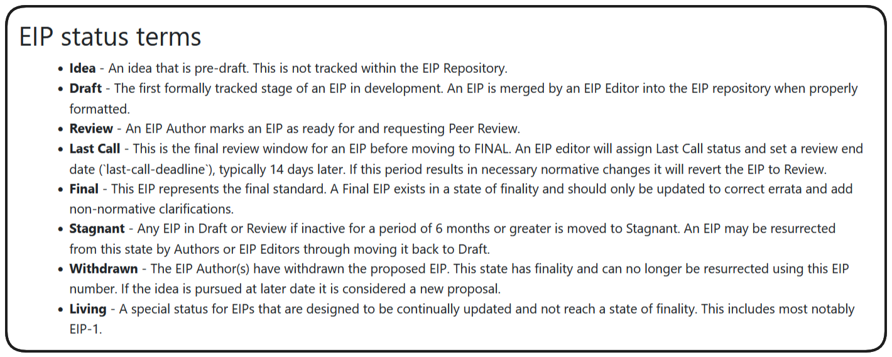

# Introduction to ERC fundamentals and ERC20
- ***Delve into the fundamentals of ERC20 tokens. Understand the critical concepts of Ethereum Improvement Proposals (EIPs) and Ethereum Request for Comments (ERCs), focusing particularly on the ERC20 Token Standard. Learn about the creation and significance of ERC20***

### ERC20 Basics
- Welcome back! I hope you're ready to move into some more advanced concepts in Web3. In this section we're going to be diving into `ERC20s`, and how to `develop`, `deploy` and `test` them.
- You can find the code associated with section in the **[GitHub repo](https://github.com/Cyfrin/foundry-full-course-cu)** associated with this course, and in the **[section repo specifically](https://github.com/Cyfrin/foundry-erc20-cu)**.
- Before we rush into creating our own `ERC20 Token`, let's take a moment to learn _what_ an `ERC20` is, what `EIPs` are and where all these acronyms mean.

## ERCs and EIPs
- The Web3 and blockchain ecosystem is fundamentally democratic and open source. As such major blockchains will often implement methods by which the community can submit suggestions for changes in methodologies and standards. These are typically known is `Improvement Proposals`, and in the Ethereum ecosystem they are `Ethereum Improvement proposals` (`EIPs`).
- If `EIPs` get enough traction to warrant genuine consideration they will often generate a `Request for Comments`, in Ethereum these are known as `Ethereum Request for Comments` (`ERCs`).

>> ❗ **NOTE** `EIPs` and `ERCs` are numbered chronologically! `ERC20` is the 20th request for comments that was created.

- New `Improvement Proposals` and `Requests for Comments` are tracked on websites such as **[eips.ethereum.org](https://eips.ethereum.org/)**, where you can watch these proposals go through the process real time and be adopted or rejected by the community.

## 