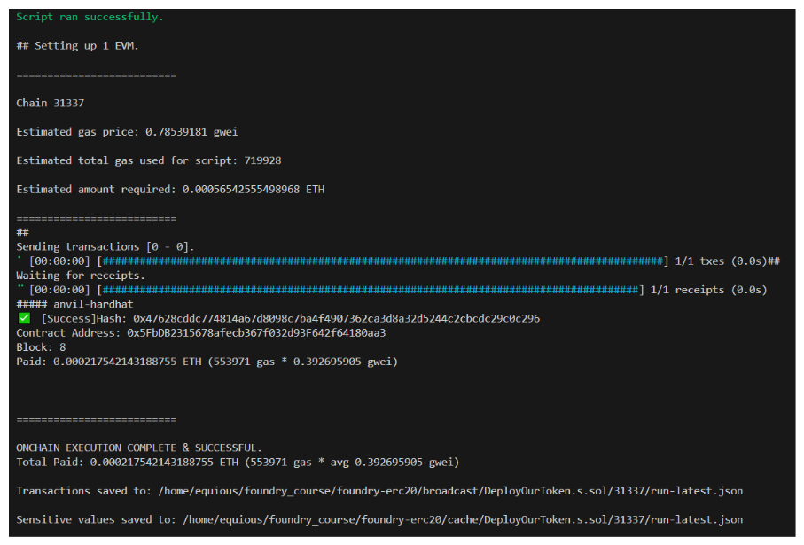

# Deploy your ERC20 crypto currency
- ***This lesson provides a comprehensive guide on deploying your ERC20 token. It includes instructions for setting up a deployment script, using the deployment script to deploy your token, and tips for finalizing and testing the deployment process efficiently.***

### ERC20 Deploy Script
- With our simple token contract written, we'll of course want to test and deploy it. Let's get started with writing a deploy script.
- In your workspace's `script` folder, create a file named `DeployOurToken.s.sol`.
- We expect OurToken to behave the same, regardless of the chain it's deployed on, so we don't really need a `HelperConfig` for this example. We'll skip that step and move write into writing the deploy script.
- To begin, we can import Script and OurToken as well as add the skeleton of our run function:

```solidity
// SPDX-License-Identifier: MIT

pragma solidity ^0.8.18;

import {Script} from "forge-std/Script.sol";
import {OurToken} from "../src/OurToken.sol";

contract DeployOurToken is Script {
    function run() external {}
}
```

- We're going to keep this really basic, we just want to deploy OurToken. We know that OurToken requires an initial supply as a constructor parameter, so let's declare that and then deploy our contract.

```solidity
// SPDX-License-Identifier: MIT

pragma solidity ^0.8.18;

import {Script} from "forge-std/Script.sol";
import {OurToken} from "../src/OurToken.sol";

contract DeployOurToken is Script {
    uint256 public constant INITIAL_SUPPLY = 1000 ether;

    function run() external returns (OurToken) {
        vm.startBroadcast();
        OurToken ot = new OurToken(INITIAL_SUPPLY);
        vm.stopBroadcast();

        return ot;
    }
}

```

- Our deploy script looks great! To make things a little easier on ourselves when using the CLI to run this script, copy the Makefile from the course GitHub repo and add this to our workspace (I've included it below to copy if needed).

### Makefile

```makefile
-include .env

.PHONY: all test clean deploy fund help install snapshot format anvil

DEFAULT_ANVIL_KEY := 0xac0974bec39a17e36ba4a6b4d238ff944bacb478cbed5efcae784d7bf4f2ff80

help:
	@echo "Usage:"
	@echo "  make deploy [ARGS=...]\n    example: make deploy ARGS=\"--network sepolia\""
	@echo ""
	@echo "  make fund [ARGS=...]\n    example: make deploy ARGS=\"--network sepolia\""

all: clean remove install update build

# Clean the repo
clean  :; forge clean


ifeq ($(findstring --network sepolia,$(ARGS)),--network sepolia)
	NETWORK_ARGS := --rpc-url $(SEPOLIA_RPC_URL) --private-key $(PRIVATE_KEY) --broadcast --verify --etherscan-api-key $(ETHERSCAN_API_KEY) -vvvv
endif

deploy:
	@forge script script/DeployOurToken.s.sol:DeployOurToken $(NETWORK_ARGS)

# cast abi-encode "constructor(uint256)" 1000000000000000000000000 -> 0x00000000000000000000000000000000000000000000d3c21bcecceda1000000
# Update with your contract address, constructor arguments and anything else
verify:
	@forge verify-contract --chain-id 11155111 --num-of-optimizations 200 --watch --constructor-args 0x00000000000000000000000000000000000000000000d3c21bcecceda1000000 --etherscan-api-key $(ETHERSCAN_API_KEY) --compiler-version v0.8.19+commit.7dd6d404 0x089dc24123e0a27d44282a1ccc2fd815989e3300 src/OurToken.sol:OurToken

```

- Now, by running `make anvil` (open a new terminal once your chain has started!) followed by `make deploy`...



### Wrap Up
- Woo! Deployment to our anvil chain successful, let's go!
- In the next lesson, we'll test our contracts with the help of some AI tools and recap everything we've gone over so far. See you there!
