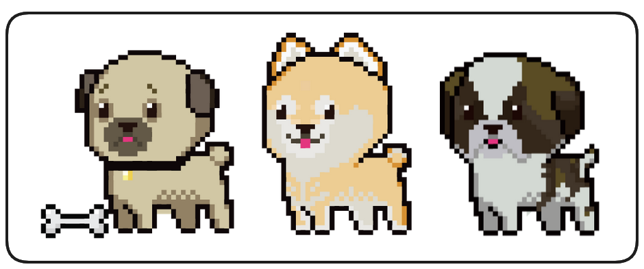

# Introduction to NFTs
- ***This introductory lesson on `Non-Fungible Tokens (NFTs)` covers the basics of NFTs, including their creation, dynamics, and values. It features a practical project involving dynamic NFTs of dogs, emphasizing the addition of NFTs to MetaMask and connecting with platforms like OpenSea and Rarible to explore trading, metadata updates, and the unique traits of dynamic NFTs.***

### NFTs
- Welcome back! In this section of the course we'll be investigate `Non-fungible Tokens (NFTs)`, we'll learn what an `NFT` is, why they're so cool and how to create our very own NFTs, one basic and one advanced.

>> ❗ **PROTIP** All the code discussed in this section is available in the associated **[GitHub Repo](https://github.com/Cyfrin/foundry-nft-cu)**.

- As mentioned, we'll be learning two approaches to simple NFT development in this course. This first will be a basic implementation using these cute puppies!

- In this first basic implementation our images are going to be stored in **[IPFS](https://ipfs.tech/)**.
- With our second NFT, the art is going to be stored _on-chain_ and dynamic, changing based on a criteria we set, setting our mood from happy to sad or vice versa!

- And, perhaps most excitingly, by the end of this section you'll have you're very own NFTs imported into your own wallet/metamask. You can also view them on service like OpenSea which will allow you to sell, trade, view and collect all sorts of NFTs!

### Wrap Up
- This is probably one of the most exciting sections for many people. NFTs are an exciting technology and an inspiring form of artistic expression.
- Let's not waste any more time and start from the beginning. In the next lesson - **What is an NFT?**
