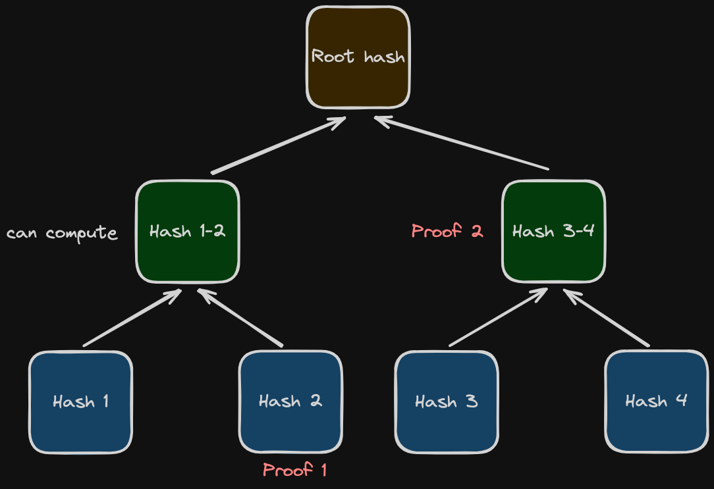

# Merkle Proofs
- ***What are Merkle trees, proofs and roots?***

### Introduction
- Merkle Trees, Merkle Proofs, and Root Hashes are very important concepts in the realm of IT and blockchain technology. Invented by Ralph Merkle in 1979, a Merkle tree is a hierarchical structure where its base consists of **leaf nodes** representing data that has been hashed. The top of the tree is the **root hash**, created by hashing together pairs of adjacent nodes. This process continues up the tree, resulting in a single **root hash** that will represents all the data in the tree.

### Merkle Proofs
- Merkle proofs will verify that a specific piece of data is part of a Merkle Tree and consist of the hashes of **sibling nodes** present at each level of the tree.
- For example, to prove that `Hash B` is part of the Merkle Tree, you would provide _Hash A_ (sibling 1) at the first level, and the _combined hash of Hash C and Hash D_ (sibling 2) at the second level as proofs.
